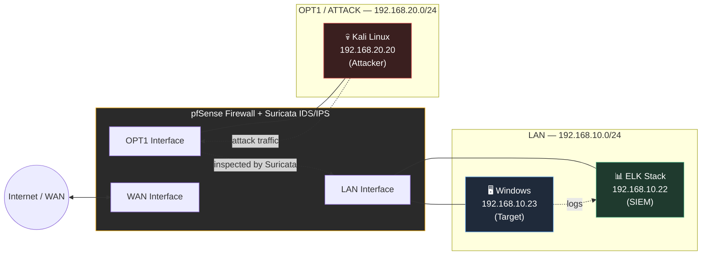
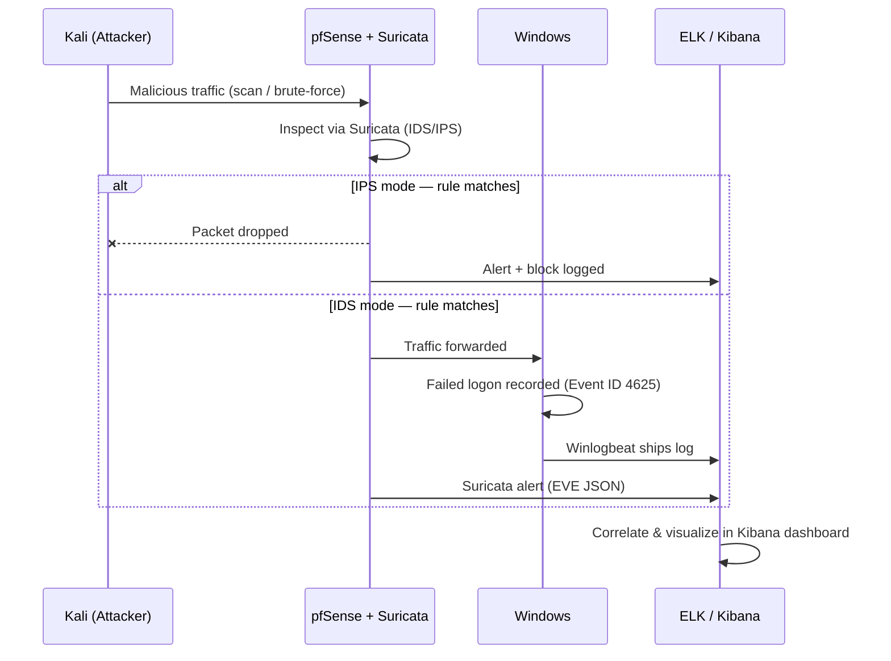

# 🛡️ Cybersecurity Lab — Firewall · IDS/IPS · SIEM

### End-to-end network security lab built with pfSense, Suricata, and the ELK Stack

*A segmented lab environment demonstrating perimeter defense, intrusion detection/prevention, and centralized log analysis — from attack to alert.*

 

 

## Overview

This repository documents a fully virtualized cybersecurity lab built to demonstrate a realistic **detect → alert → correlate** security pipeline. Two isolated networks — a trusted **LAN** and an **attack network** — are separated by a **pfSense** firewall running **Suricata** as an inline IDS/IPS. All security-relevant events (firewall blocks, IDS/IPS alerts, and Windows authentication logs) are shipped to an **ELK Stack** SIEM and visualized in **Kibana**.

The lab simulates real attacker behavior from a **Kali Linux** host — port scans and brute-force login attempts — and traces each attack end-to-end through the stack: from the wire, to the firewall rule, to the Suricata alert, to the Kibana dashboard.

## Architecture

**Attack path:** `Kali (OPT1)` → `pfSense (Firewall + Suricata)` → `Windows (LAN)`, with every hop logged and forwarded to `ELK`.

The two client networks are kept on separate virtual switches with no direct link — every packet between them is forced through pfSense, which makes the firewall and IDS/IPS the sole enforcement and visibility point in the lab.

 

## Tech Stack

| Layer | Technology | Role |
|---|---|---|
| **Hypervisor** | VMware Workstation | Hosts all 4 virtual machines on isolated virtual networks |
| **Firewall / Router** | pfSense | Segments LAN / OPT1 / WAN, enforces firewall rules, hosts Suricata |
| **IDS / IPS** | Suricata (inline mode) | Detects and, in IPS mode, blocks malicious traffic in real time |
| **SIEM** | Elasticsearch + Kibana (ELK) | Ingests, indexes, and visualizes logs from all sources |
| **Log Shipper** | Filebeat / Winlogbeat | Forwards pfSense, Suricata (EVE JSON), and Windows Security logs to ELK |
| **Attacker** | Kali Linux | Runs Nmap scans and Hydra brute-force attempts |
| **Target** | Windows | Victim host with audited logon events (Event ID 4625) |
| **VPN (bonus)** | WireGuard | Remote access tunnel configured on pfSense |

 

## Network Layout

| Host | Interface | IP Address | Role |
|---|---|---|---|
| pfSense | WAN | `10.10.1.128/24` | Simulated internet uplink |
| pfSense | LAN | `192.168.10.1/24` | Gateway for trusted network |
| pfSense | OPT1 | `192.168.20.1/24` | Gateway for attack network |
| Windows | LAN | `192.168.10.23` | Target / victim host |
| ELK Stack | LAN | `192.168.10.22` | SIEM server |
| Kali Linux | OPT1 | `192.168.20.20` | Attacker host |

 

## What This Lab Demonstrates

- Network segmentation with a firewall as the single point of control between trusted and untrusted zones
- Firewall rule creation, logging, and allow/deny policy design on pfSense
- Intrusion detection with Suricata, including custom detection rules
- Intrusion **prevention** — switching Suricata from passive IDS to inline IPS and actively dropping malicious packets
- Centralized log collection from network, host, and security appliance sources
- SIEM correlation and visualization of failed logins, IDS/IPS alerts, and firewall blocks in Kibana dashboards
- Full attack lifecycle tracing — from the attacker's terminal to a dashboard panel

 

## Project Phases

| Phase | Focus | Summary |
|---|---|---|
| **1 — Environment Setup** | Virtualization | 4 VMs provisioned across 3 segmented interfaces (WAN / LAN / OPT1); full connectivity matrix verified |
| **2 — Firewall Configuration** | pfSense | LAN → WAN internet access, controlled OPT1 → LAN attack path, blocking rule, logging enabled |
| **3 — IDS/IPS** | Suricata | ET Open ruleset + 3 custom rules; validated in both **IDS** (detect-only) and **inline IPS** (detect + block) modes |
| **4 — SIEM** | ELK Stack | Elasticsearch/Kibana deployment, Windows audit policy, Filebeat/Winlogbeat shipping, pfSense + Suricata log integration, working dashboard |
| **5 — Attack & Detection** | Kali Linux | Nmap port scan and Hydra RDP brute-force attacks, traced end-to-end into Kibana |
| **Bonus — VPN** | WireGuard | Remote-access tunnel configured on pfSense with a Windows client peer |

 

## 🔄 Detection Pipeline

 

## Roadmap

- [ ] Add Suricata inspection on the LAN interface for outbound/return traffic visibility
- [ ] Automate ELK dashboard provisioning via saved objects / Kibana API
- [ ] Add a second attack scenario (e.g., SMB relay or lateral movement)
- [ ] Migrate lab config to Infrastructure-as-Code (Vagrant/Packer) for reproducibility

 

⭐ *If you found this lab useful for learning firewall, IDS/IPS, or SIEM concepts, consider giving it a star.*

